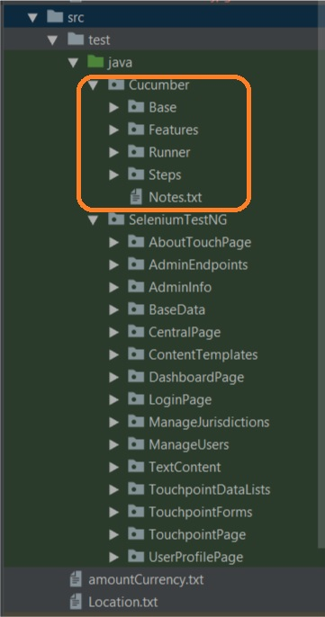
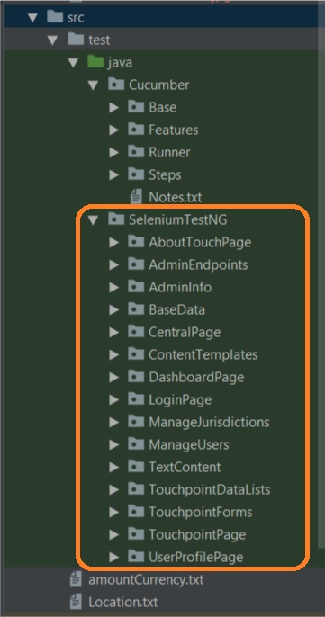
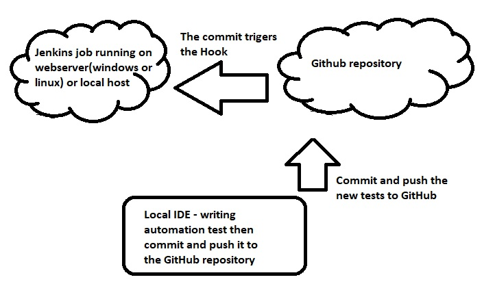
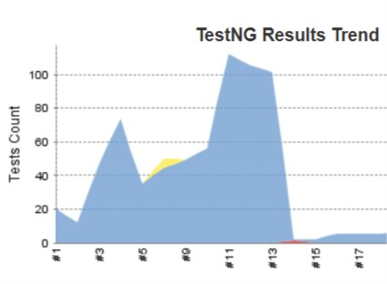

# TouchTestSeleniumTestNG

## Test automation framework pilot for Touch tracking system

### Goal of this test automation framework

The main reason was to ease and accelerate the testing process.
The test suites are contains regression test thus we did not have to spend our time to test the regression part after every new version.

- As this project was a pilot the main requirements were:
    - Tools that are open sourced
    - Easy to use and easily readable for the Business Analyst
    - User Support
    - Expand the coding and automation knowledge for the QA team
    - Ensure higher quality

To fulfill these requirements I choose the below mention stacks and technologies.

### About the Touch project
This project is a basic payout tracking software. The goal was to build a software that will follow the payout processes and informed the customer as the payout processes are sometimes more complex and time consuming in the case of insurance. 
The idea came from that most of the time the the customers are impatient and they call the customer service very often. Hence the customer don’t have to call always the customer service and they notified about the status change via e-mail or SMS.  

For this I built this pilot test framework alone without any help from the developers. Because of this it may be contains bad coding practices.

### Used technology

- Used IDE: 
    - IntelliJ IDEA Community Edition
  
- Stack: 
    - Java
    - Selenium WebDriver
    - TestNG
    - Cucumber
    - Maven
    - Jenkins
    - Git and Github
    - TestNG report plugin
    - Cucumber reports plugin
  
- Used browser: 
    - Google Chrome

### Structure 

- pom.xml (Project Object Model)
    - POM is the fundamental unit of work in Maven. It is an XML file that contains information about the project and configuration details used by Maven to build the project. It contains default values for most projects.

- Structure for Cucumber:
    - 
    - Base package
        - It contains the basic often used variables.
    - Features package
        - It contains the feature files, written in BDD format. Basically these are the business test cases
    - Runner package
        - It contains It is responsible for run the test.
    - Steps package
        - It contains the .java files that are responsible for the each feature step. It also contains TestNG folders for the Asserts etc.
                    
- Structure for TestNG:
    - 
    - I have to determine in the testng.xml file which test/packages/suites would I like to run.
    - For each page have different directory and those directories contains the test files and the connected test driver thus the test are much more readable. 
        - Example:
            - The Test contains the test itself called "loginIntoTouch()"
            - The TestDriver contains the logic behind the "urlIsAssert()" function

````
    @Test(description = "I can log into the application")
    public void loginIntoTouch() {

        login(ukJurisdictionOperatorName, ukJurisdictionOperatorPassword);
        urlIsAssert(touchCentral.url());
    }
````

- Differences:
    - The test were written as classes with testNG unlike in the case of Cucumber, because there the tests were written in readable BDD format.
    - I started firstly the create tht TestNG package, but it was not fulfill the readability requirement.

- Process
    - The committed tests will trigger the jenkins job
    - Deploy and CI process:
        1. Write automation test
        2. Commit to git and the github the repository
        3. The commit triggers the Jenkins job

    
### Reporting
  
- Reporting:

    - TestNG report:
        - This is a basic Jenkins plugin. It shows basic information about the runs and errors. 
        - Verdict:
            - Easy to install and apply    

    - Cucumber report:
        - For this report I had to use Jenkins plugin and configure the pom.xml file to create a new more colorful Cucumber report    
        - Verdict:
            - It is more complex to configure the the simple TestNG report plugin. 
            - More colorful and more transparent
            - Only the last running results is available
            

## Conclusion

In this section I will summarize and explain my experiences about this framework.

- Ease of to build as a QA 
    - It was not so hard to build as a lot of online source can show and explain to us how to do it. 
    - The only problem was the coding and architecture practice. Every company follows its own coding structure. As I built it myself I tried to find and applied these practices. One of the best practice is the Page Object Model.
- Ease of use as a QA or BA
    - It is very easy to use the Jenkins itself as we have to click on the "Run" button
- Maintain the test suite
    - Once we built the framework it is easy to expand and change the test. 
    - The hardest part would be to learn the Java coding and usage of POM and behavior of Selenium.
- Break-even rate
    - Financially:
        - As the software were open sourced the tools were free
    - Time spend to build:
        - As a QA sometime I had problem and stuck. I tried free AWS linux server, but it was very hard to configure so I also tried free AWS Windows server as it is easier to configure. But for this w get limited resources and later on it will take to much time to run the tests. Because of this I used my local machine to run the tests. 
    - Time spend to learn coding and architecture:
        - This part involves a lot of practice. We can find a lot of useful information on the internet, so the downside is that we have to take the time and practice it.
    - Time spend to expand test suite:
        - Once we have the framework it is very fast to expand it.
- Lesson learned:
    -   In summarize to build this pilot was an interesting experience. 
    One of the biggest lesson was that nowadays as a QA it is very important to have coding knowledge. 
    For this it would have been very important to separate time for the member of the QA team to practice together with the developers.
    Moreover the project get a huge advantage from these test as the quality became measurable and more transparent. 
    It saves a lot of time and we get instant feedback about the quality or the bugs that appears in the system after deployment or malfunction.